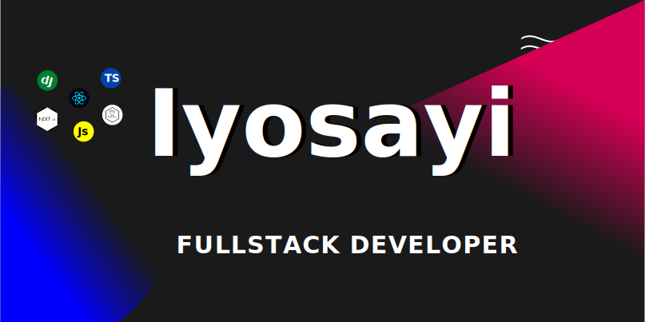

# Hi there i'm iyosayi

I'm iyosayi a fullstack developer and freelancer, currenlty studying computer science. I'm enthusiactic about learning and building software thats going to change the world someday :), i also write articles on blockchain dev, frontend dev and backend dev on [My blog](https://Iyostack.hasnode.dev)✌.

* I'm currently working on some projects to fill up my portfolio💪🏾.

* Planning on collaborating on open source projects in my skill set👨🏾‍🔬.

* I'm also learning and improving my skills on backend, frontend and blokchain dev by building some projects. Some are listed in my repositories👨🏾‍💻.

## Connect with me

I share updates and i'm active on  [Twitter](https://twitter.com/iyosayi18) , [Linkedln](https://www.linkedin.com/in/iyosayi-onaiwu-6a8739212/) and [instagram](https://instagram.com/iyosayi18)